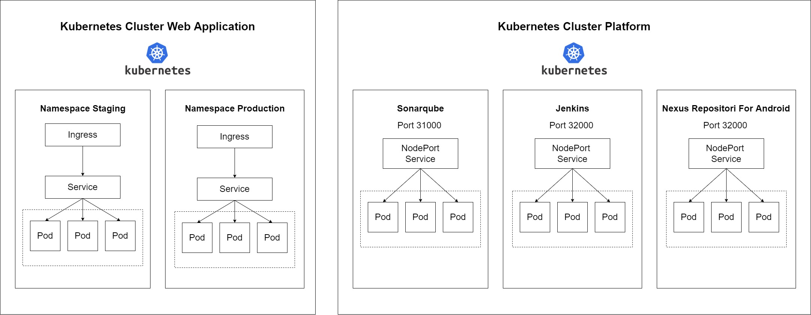
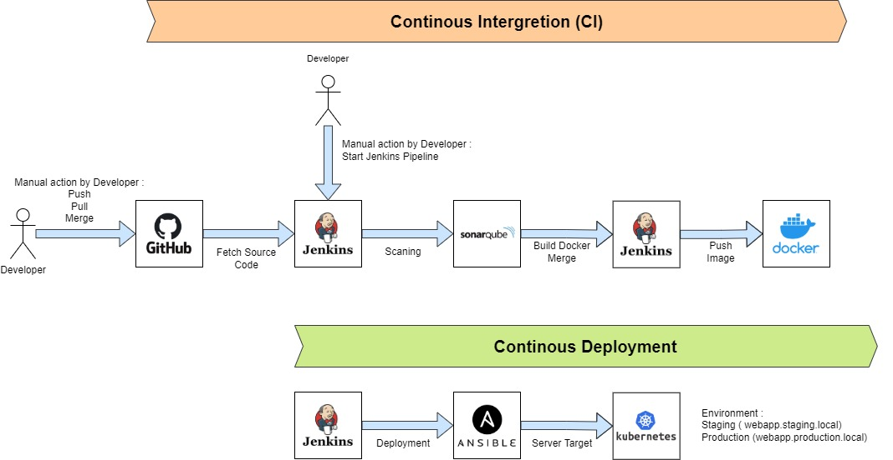
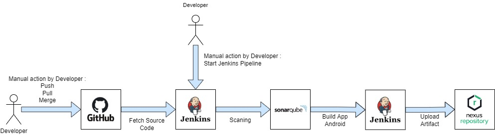

# Technical Assesment Devops

This project explains how it works in CI/CD ( Continous Integration/Continous Deployment ) for web application and mobile application. Tools used in this project is kubernetes to manange platform web application, CI/CD stack (jenkins,sonarqube,nexus), and use github to source code management.

## Table Of Content

- [Design Architecture](#design-architecture)
- [How to Use CI/CD Web backend and Android](./document/Technical%20Assesment%20Devops.pdf)

## Design Architecture

#### Kubernetes Platform

#### CI/CD Flow Web Application

#### CI/CD Flow Android Application

